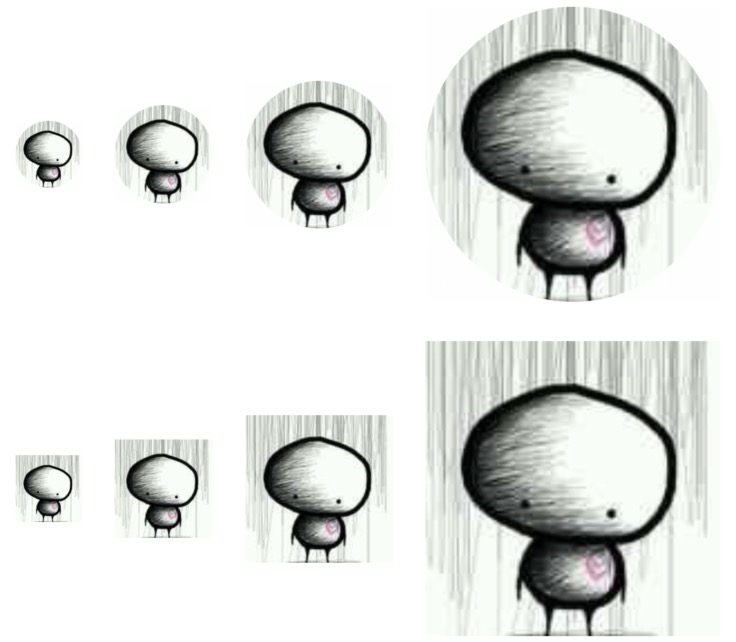

# Avatar

## Examples

### Basic

Four sizes and two shapes



```jsx
//default shape
<Avatar size='small' source={{ uri: 'https://avatars3.githubusercontent.com/u/16103819' }}/>
<Avatar size='medium' source={{ uri: 'https://avatars3.githubusercontent.com/u/16103819' }}/>
<Avatar size='large' source={{ uri: 'https://avatars3.githubusercontent.com/u/16103819' }}/>
<Avatar size='xlarge' source={{ uri: 'https://avatars3.githubusercontent.com/u/16103819' }}/>
//square
<Avatar type='square' size='small' source={{ uri: 'https://avatars3.githubusercontent.com/u/16103819' }}/>
<Avatar type='square' size='medium' source={{ uri: 'https://avatars3.githubusercontent.com/u/16103819' }}/>
<Avatar type='square' size='large' source={{ uri: 'https://avatars3.githubusercontent.com/u/16103819' }}/>
<Avatar type='square' size='xlarge' source={{ uri: 'https://avatars3.githubusercontent.com/u/16103819' }}/>
```

### Type


